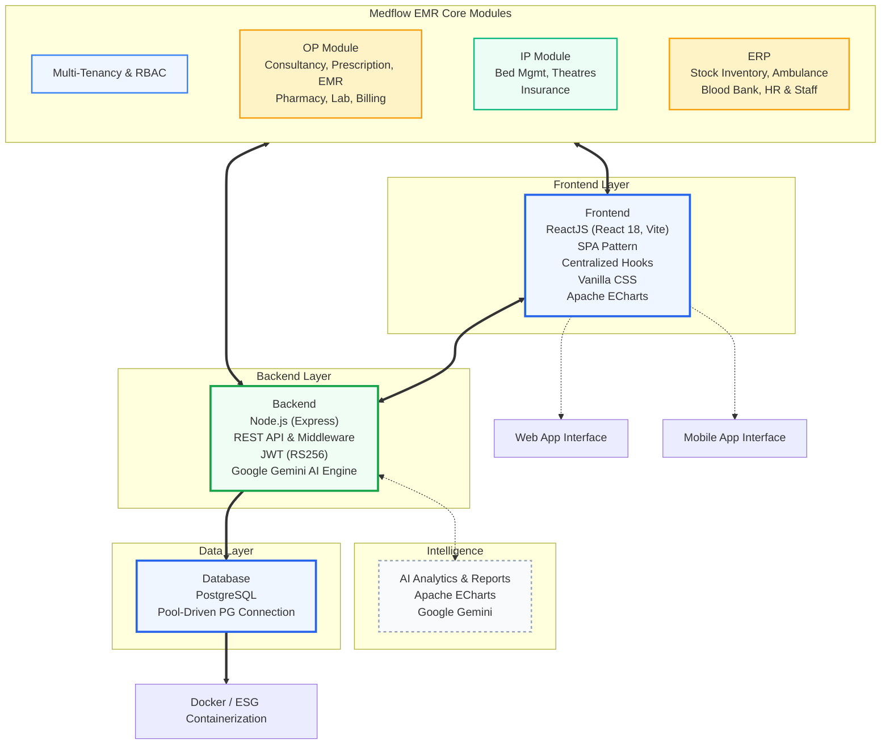

# Architecture Design

Last updated: 2026-03-29

## 1. System Overview
The Medflow EMR is a multi-tenant SaaS platform optimized for healthcare clinical workflows. It utilizes a layered architecture consisting of a React-based SPA frontend, an Express-based REST API backend, and a PostgreSQL database layer.

## 2. Architecture Diagram (High Level)

## 3. Tech Stack Matrix

### 3.1 Frontend (The Clinical Interface)
- **Framework**: **ReactJS (React 18)** with Vite for high-performance HMR.
- **Architectural Pattern**: Single Page Application (SPA) with component-based architecture.
- **State Management**: Centralized application state in `App.jsx` using React Hooks for cross-module consistency.
- **Design System**: **Critical Care Design System**—a custom-built Vanilla CSS architecture focused on cognitive ergonomics and zero-runtime overhead.
- **Visualization**: **Apache ECharts** for high-density clinical and fiscal analytics.
- **Icons**: **Lucide-React** for premium, healthcare-standard UI across all modules.

### 3.2 Backend (The Governance Layer)
- **Runtime**: **Node.js 20+** with Express.js framework.
- **API Architecture**: RESTful API pattern for predictable client-server communication.
- **Middleware Pattern**: Modular pipeline architecture (Express Middleware) for request authentication, tenant resolving, permission validation, and feature gating.
- **Security**: **JWT (RS256)** authentication for stateless, tenant-scoped identity management.
- **AI Intelligence**: **Google Gemini-1.5-Flash** integrated for generative clinical summarization and decision support.

### 3.3 Data Layer (The Institutional Persistence)
- **Database**: **PostgreSQL** relational database for ACID-compliant clinical and financial records.
- **Isolation Strategy**: Single-schema multi-tenancy with `tenant_id` scoping at the query level (Row-Level Security pattern equivalent).
- **Connection Strategy**: Pool-driven PostgreSQL client for optimized resource lifecycle.

### 3.4 Infrastructure & Operations
- **Deployment**: Container-first architecture for elastic scalability.
- **Observability**: Real-time KPI aggregation nodes for system health monitoring.
- **Modernization Stack**: Integrated **Global Toast Notification** system and **Cost Governance Dashboard**.

## 4. Multi-Tenant Financial Sharding
- **Offer Engine**: Dynamic tier pricing and discount provisioning logic mapped per tenant.
- **Cost Governance**: Real-time compute utilization and vendor cost tracking for institutional efficiency.
- **Payment Nodes**: Decoupled Platform and Tenant payment flows, allowing hospitals to use their own gateway shards.
