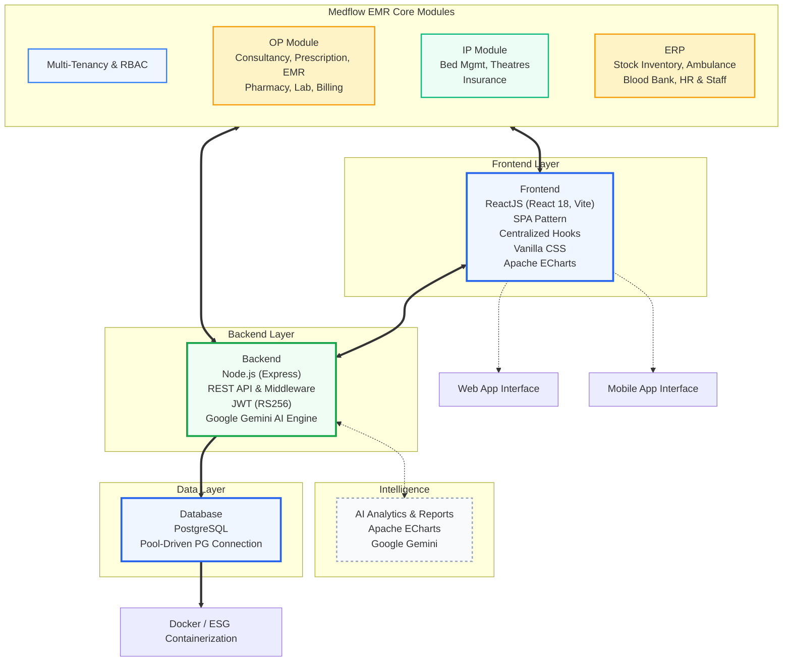

# Architecture Design

Last updated: 2026-03-31

## 1. System Overview
The Medflow EMR is a multi-tenant SaaS platform optimized for healthcare clinical workflows. It utilizes a layered architecture consisting of a React-based SPA frontend, an Express-based REST API backend, PostgreSQL database with **Prisma ORM**, and **Render cloud deployment** for scalability.

## 2. Low-Level Architecture Details

### 2.1 Frontend Architecture (React SPA)

#### **Component Hierarchy**
```
App.jsx (Root Component)
├── ErrorBoundary
├── AppLayout.jsx (Navigation & Layout)
│   ├── Sidebar Navigation
│   ├── Header
│   └── Main Content Area
└── View-based Routing
    ├── PatientProfilePage.jsx
    ├── PatientsPage.jsx
    ├── DashboardPage.jsx
    └── [Other clinical modules]
```

#### **State Management Pattern**
```javascript
// Centralized state in App.jsx
const [view, setView] = useState('dashboard');
const [activePatientId, setActivePatientId] = useState('');
const [session, setSession] = useState(null);
const [tenant, setTenant] = useState(null);
const [patients, setPatients] = useState([]);

// View-based routing (not traditional React Router)
{view === 'patient-profile' && <PatientProfilePage patientId={activePatientId} />}
{view === 'patients' && <PatientsPage setView={setView} />}
```

#### **API Layer Architecture**
```javascript
// api.js - Centralized API client
const api = {
  // Authentication
  login: (credentials) => fetch('/api/auth/login', {...}),
  logout: () => fetch('/api/auth/logout', {...}),
  
  // Patient Management
  getPatients: (tenantId, options) => fetch(`/api/patients/${tenantId}`, {...}),
  createPatient: (data) => fetch('/api/patients', {...}),
  getPatient: (patientId) => fetch(`/api/patients/${patientId}`, {...}),
  
  // Clinical Data
  getMedicalHistory: (patientId) => fetch(`/api/patients/${patientId}/medical-history`, {...}),
  getDiagnostics: (patientId) => fetch(`/api/patients/${patientId}/diagnostics`, {...}),
  getMedications: (patientId) => fetch(`/api/patients/${patientId}/medications`, {...}),
  
  // FHIR Integration
  getFHIRPatient: (patientId) => fetch(`/api/fhir/Patient/${patientId}`, {...}),
  getFHIRObservations: (patientId) => fetch(`/api/fhir/Observation?patient=${patientId}`, {...})
};
```

#### **Permission-Based Access Control**
```javascript
// config/modules.js - Role-based permissions
const fallbackPermissions = {
  Admin: ['dashboard', 'patients', 'patient-profile', 'emr', 'inpatient', 'billing', ...],
  Doctor: ['dashboard', 'patients', 'patient-profile', 'emr', 'reports', ...],
  Nurse: ['dashboard', 'patients', 'patient-profile', 'inpatient', ...],
  Lab: ['dashboard', 'patients', 'patient-profile', 'reports', ...],
  // ...
};

// Permission validation in App.jsx
const allowedViews = useMemo(() => {
  const roleViews = permissions[userRole] || ['dashboard'];
  return roleViews.filter(view => tenantHasAccess(view));
}, [permissions, userRole, tenant]);
```

### 2.2 Backend Architecture with Prisma ORM

#### **Prisma Service Layer**
```javascript
// server/lib/prisma.js - Type-safe database access
class PrismaService {
  constructor() {
    this.prisma = new PrismaClient({
      adapter: new PrismaPg(),
      log: process.env.NODE_ENV === 'development' ? ['query', 'info', 'warn', 'error'] : ['error']
    });
  }

  // Tenant-aware queries with automatic isolation
  getTenantScopedPrisma(tenantId) {
    return {
      patient: {
        findMany: (args) => this.prisma.patient.findMany({ 
          ...args, 
          where: { ...args.where, tenantId } 
        }),
        create: (args) => this.prisma.patient.create({ 
          ...args, 
          data: { ...args.data, tenantId } 
        }),
        // ... other operations with automatic tenant scoping
      }
    };
  }
}
```

#### **Database Schema with Prisma**
```prisma
// Multi-tenant schema with type safety
model Patient {
  id          String    @id @default(cuid())
  tenantId    String    // Automatic tenant isolation
  mrn         String    // Medical Record Number
  firstName   String
  lastName    String
  dateOfBirth DateTime?
  gender      String?
  phone       String?
  email       String?
  isActive    Boolean   @default(true)
  createdAt   DateTime  @default(now())
  updatedAt   DateTime  @updatedAt

  // Relations with automatic loading
  appointments      Appointment[]
  encounters         Encounter[]
  medicalHistory     MedicalHistory[]
  medications        Medication[]
  diagnostics        Diagnostic[]
  vitals             Vital[]
  billing            Invoice[]

  @@unique([tenantId, mrn])
  @@map("patients")
}
```

#### **Controller Pattern with Type Safety**
```javascript
// server/controllers/patient.controller.js
class PatientController {
  async getPatients(req, res) {
    try {
      const { tenantId } = req.user;
      const { limit = 50, offset = 0, search } = req.query;

      const db = prismaService.getTenantScopedPrisma(tenantId);
      
      // Type-safe queries with automatic tenant filtering
      const patients = await db.patient.findMany({
        where: search ? {
          OR: [
            { firstName: { contains: search, mode: 'insensitive' } },
            { lastName: { contains: search, mode: 'insensitive' } },
            { mrn: { contains: search, mode: 'insensitive' } }
          ]
        } : {},
        include: {
          appointments: true,
          medicalHistory: true,
          _count: true
        },
        orderBy: { lastName: 'asc' },
        take: parseInt(limit),
        skip: parseInt(offset)
      });

      res.json({ patients });
    } catch (error) {
      res.status(500).json({ error: 'Failed to fetch patients' });
    }
  }
}
```

### 2.3 Data Flow Architecture

#### **Request Lifecycle with Prisma**
```
1. User Action (Click MRN button)
   ↓
2. React Component Event Handler
   setView('patient-profile');
   setActivePatientId(patientId);
   ↓
3. State Change Triggers Re-render
   ↓
4. PatientProfilePage Component Mounts
   ↓
5. useEffect Triggers API Calls
   api.getPatient(patientId);
   api.getMedicalHistory(patientId);
   ↓
6. API Client Makes HTTP Requests
   ↓
7. Backend Controller Processes Request
   ↓
8. Prisma Service Executes Type-Safe Query
   ↓
9. PostgreSQL Database Executes Query
   ↓
10. Response Returns with Typed Data
   ↓
11. Component State Updates
   ↓
12. UI Re-renders with Type-Safe Data
```

### 2.4 Security Architecture

#### **Multi-Tenant Data Isolation**
```javascript
// Automatic tenant enforcement through Prisma
const db = prismaService.getTenantScopedPrisma(tenantId);
// All queries automatically include: WHERE tenantId = ?

// Backend middleware for tenant resolution
app.use('/api/patients', (req, res, next) => {
  const tenantId = req.user?.tenantId;
  if (!tenantId) return res.status(403).json({ error: 'Tenant required' });
  req.tenantId = tenantId;
  next();
});
```

#### **JWT Authentication Flow**
```javascript
// Frontend token management
const login = async (credentials) => {
  const response = await api.login(credentials);
  const { token, user, tenant } = response.data;
  
  localStorage.setItem('auth_token', token);
  setSession({ user, tenant });
};

// Backend token validation with type safety
const authenticateToken = (req, res, next) => {
  const token = req.header('Authorization')?.replace('Bearer ', '');
  
  try {
    const decoded = jwt.verify(token, process.env.JWT_SECRET);
    req.user = decoded; // Type-safe user object
    next();
  } catch (error) {
    res.status(401).json({ error: 'Invalid token' });
  }
};
```

### 2.5 Render Deployment Architecture

#### **Service Configuration**
```yaml
# render-production.yaml
services:
  - type: pserv
    name: emr-database
    databaseName: emr
    
  - type: redis
    name: emr-redis
    
  - type: web
    name: emr-application
    runtime: node
    nodeVersion: 20
    buildCommand: cd client && npm install && npm run build && cd .. && npm install
    startCommand: npm start
    envVars:
      - key: DATABASE_URL
        fromDatabase:
          name: emr-database
          property: connectionString
      - key: REDIS_URL
        fromService:
          type: redis
          name: emr-redis
          property: connectionString
```

#### **Production Configuration**
```javascript
// server/config/production.js
export const config = {
  port: process.env.PORT || 10000,
  database: {
    url: process.env.DATABASE_URL,
    ssl: process.env.NODE_ENV === 'production',
    pool: {
      min: 2,
      max: 10,
      idleTimeoutMillis: 30000,
    }
  },
  redis: {
    url: process.env.REDIS_URL,
    ttl: 3600,
  },
  jwt: {
    secret: process.env.JWT_SECRET,
    expiresIn: '7d',
  }
};
```

## 3. Architecture Diagram (High Level)


## 4. Performance Optimization Architecture

### 4.1 Frontend Performance Patterns

#### **Lazy Loading Strategy**
```javascript
// Code splitting for better performance
const PatientProfilePage = lazy(() => import('./pages/PatientProfilePage.jsx'));
const PatientsPage = lazy(() => import('./pages/PatientsPage.jsx'));

// Suspense boundary with loading fallback
<Suspense fallback={<div>Loading...</div>}>
  {view === 'patient-profile' && <PatientProfilePage />}
</Suspense>
```

#### **Memoization Patterns**
```javascript
// Expensive computations cached
const filteredPatients = useMemo(() => {
  return patients.filter(p => 
    p.name.toLowerCase().includes(searchQuery.toLowerCase())
  );
}, [patients, searchQuery]);

// Callback memoization to prevent re-renders
const handlePatientSelect = useCallback((patientId) => {
  setActivePatientId(patientId);
  setView('patient-profile');
}, []);
```

#### **API Response Caching**
```javascript
// Request deduplication and caching
const apiCache = new Map();

const cachedApiCall = async (url, options = {}) => {
  const cacheKey = `${url}-${JSON.stringify(options)}`;
  
  if (apiCache.has(cacheKey)) {
    return apiCache.get(cacheKey);
  }
  
  const response = await fetch(url, options);
  const data = await response.json();
  
  apiCache.set(cacheKey, data);
  return data;
};
```

### 4.2 Backend Performance Patterns

#### **Database Connection Pooling**
```javascript
// PostgreSQL connection pool configuration
const pool = new Pool({
  host: process.env.DB_HOST,
  port: process.env.DB_PORT,
  database: process.env.DB_NAME,
  user: process.env.DB_USER,
  password: process.env.DB_PASSWORD,
  max: 20, // Maximum connections
  idleTimeoutMillis: 30000,
  connectionTimeoutMillis: 2000,
});
```

#### **Query Optimization**
```sql
-- Indexed queries for performance
CREATE INDEX idx_patients_tenant_id ON patients(tenant_id);
CREATE INDEX idx_patients_mrn ON patients(mrn);
CREATE INDEX idx_patients_name ON patients(last_name, first_name);

-- Tenant-scoped queries for data isolation
SELECT * FROM patients 
WHERE tenant_id = $1 
  AND (first_name ILIKE $2 OR last_name ILIKE $2 OR mrn ILIKE $2)
ORDER BY last_name, first_name
LIMIT 50 OFFSET $3;
```

## 5. Deployment Architecture

### 5.1 Container Configuration
```dockerfile
# Frontend Dockerfile
FROM node:20-alpine AS builder
WORKDIR /app
COPY package*.json ./
RUN npm ci --only=production
COPY . .
RUN npm run build

FROM nginx:alpine
COPY --from=builder /app/dist /usr/share/nginx/html
COPY nginx.conf /etc/nginx/nginx.conf
EXPOSE 80
```

```dockerfile
# Backend Dockerfile
FROM node:20-alpine
WORKDIR /app
COPY package*.json ./
RUN npm ci --only=production
COPY . .
EXPOSE 3000
CMD ["npm", "start"]
```

### 5.2 Environment Configuration
```javascript
// Multi-environment support
const config = {
  development: {
    apiUrl: 'http://localhost:3000/api',
    wsUrl: 'ws://localhost:3000',
    environment: 'development'
  },
  production: {
    apiUrl: 'https://api.medflow.com/api',
    wsUrl: 'wss://api.medflow.com',
    environment: 'production'
  },
  staging: {
    apiUrl: 'https://staging-api.medflow.com/api',
    wsUrl: 'wss://staging-api.medflow.com',
    environment: 'staging'
  }
};

export default config[process.env.NODE_ENV || 'development'];
```

### 5.3 Health Check Architecture
```javascript
// Frontend health monitoring
const HealthChecker = () => {
  const [isHealthy, setIsHealthy] = useState(true);
  
  useEffect(() => {
    const checkHealth = async () => {
      try {
        const response = await fetch('/api/health');
        setIsHealthy(response.ok);
      } catch (error) {
        setIsHealthy(false);
      }
    };
    
    const interval = setInterval(checkHealth, 30000);
    return () => clearInterval(interval);
  }, []);
  
  return isHealthy ? null : <HealthAlert />;
};
```

## 6. Monitoring & Observability

### 6.1 Error Boundary Implementation
```javascript
class ErrorBoundary extends React.Component {
  constructor(props) {
    super(props);
    this.state = { hasError: false, error: null };
  }

  static getDerivedStateFromError(error) {
    return { hasError: true, error };
  }

  componentDidCatch(error, errorInfo) {
    // Log to monitoring service
    console.error('Application Error:', error, errorInfo);
    
    // Send to error tracking service
    if (process.env.NODE_ENV === 'production') {
      this.reportError(error, errorInfo);
    }
  }

  reportError = (error, errorInfo) => {
    // Integration with error tracking service
    fetch('/api/errors', {
      method: 'POST',
      headers: { 'Content-Type': 'application/json' },
      body: JSON.stringify({
        error: error.message,
        stack: error.stack,
        componentStack: errorInfo.componentStack,
        timestamp: new Date().toISOString(),
        userId: this.props.activeUser?.id,
        tenantId: this.props.tenant?.id
      })
    });
  };

  render() {
    if (this.state.hasError) {
      return <ErrorFallback error={this.state.error} />;
    }
    return this.props.children;
  }
}
```

### 6.2 Performance Monitoring
```javascript
// Performance metrics collection
const PerformanceMonitor = () => {
  useEffect(() => {
    // Core Web Vitals monitoring
    const observer = new PerformanceObserver((list) => {
      for (const entry of list.getEntries()) {
        if (entry.entryType === 'largest-contentful-paint') {
          console.log('LCP:', entry.startTime);
        }
        if (entry.entryType === 'first-input') {
          console.log('FID:', entry.processingStart - entry.startTime);
        }
      }
    });

    observer.observe({ entryTypes: ['largest-contentful-paint', 'first-input'] });

    return () => observer.disconnect();
  }, []);
};
```

## 7. Healthcare Compliance Architecture

### 7.1 HIPAA Compliance Patterns
```javascript
// PHI (Protected Health Information) handling
const PHIHandler = {
  // Audit logging for all PHI access
  logPHIAccess: (patientId, userId, action) => {
    const auditLog = {
      patientId,
      userId,
      action,
      timestamp: new Date().toISOString(),
      ipAddress: window.location.hostname,
      userAgent: navigator.userAgent
    };
    
    // Send to audit logging service
    api.post('/audit/phi-access', auditLog);
  },

  // Data encryption for sensitive information
  encryptPHI: (data) => {
    // Client-side encryption before transmission
    return btoa(JSON.stringify(data)); // Simplified for example
  },

  // Automatic session timeout for inactivity
  setupSessionTimeout: () => {
    const TIMEOUT_DURATION = 15 * 60 * 1000; // 15 minutes
    
    let timeoutId;
    const resetTimeout = () => {
      clearTimeout(timeoutId);
      timeoutId = setTimeout(() => {
        api.logout();
        window.location.href = '/login';
      }, TIMEOUT_DURATION);
    };

    // Reset timeout on user activity
    ['mousedown', 'keypress', 'scroll', 'touchstart'].forEach(event => {
      document.addEventListener(event, resetTimeout, true);
    });

    resetTimeout();
  }
};
```

### 7.2 FHIR Integration Architecture
```javascript
// FHIR resource conversion
const FHIRConverter = {
  // Convert internal patient model to FHIR Patient resource
  patientToFHIR: (patient) => ({
    resourceType: 'Patient',
    id: patient.id,
    identifier: [{
      type: { coding: [{ system: 'http://terminology.hl7.org/CodeSystem/v2-0203', code: 'MR' }] },
      value: patient.mrn
    }],
    name: [{
      family: patient.lastName,
      given: [patient.firstName]
    }],
    birthDate: patient.dateOfBirth,
    gender: patient.gender.toLowerCase(),
    telecom: [
      { system: 'phone', value: patient.phone, use: 'home' },
      { system: 'email', value: patient.email, use: 'home' }
    ]
  }),

  // Convert FHIR back to internal model
  fhirToPatient: (fhirPatient) => ({
    id: fhirPatient.id,
    mrn: fhirPatient.identifier?.[0]?.value,
    firstName: fhirPatient.name?.[0]?.given?.[0] || '',
    lastName: fhirPatient.name?.[0]?.family || '',
    dateOfBirth: fhirPatient.birthDate,
    gender: fhirPatient.gender?.charAt(0).toUpperCase() + fhirPatient.gender?.slice(1),
    phone: fhirPatient.telecom?.find(t => t.system === 'phone')?.value || '',
    email: fhirPatient.telecom?.find(t => t.system === 'email')?.value || ''
  })
};
```

## 8. Scalability Architecture

### 8.1 Horizontal Scaling Patterns
```javascript
// Load balancing ready session management
const SessionManager = {
  // Redis-based session storage for multi-instance scaling
  storeSession: async (sessionData) => {
    await api.post('/sessions', {
      sessionId: sessionData.id,
      data: sessionData,
      expiresAt: new Date(Date.now() + 24 * 60 * 60 * 1000) // 24 hours
    });
  },

  // Session recovery across instances
  recoverSession: async (sessionId) => {
    const response = await api.get(`/sessions/${sessionId}`);
    return response.data;
  }
};
```

### 8.2 Database Scaling Strategy
```sql
-- Read replica configuration for reporting queries
-- Primary database handles writes
-- Read replicas handle analytics and reporting

-- Partitioning strategy for large tables
CREATE TABLE patients_partitioned (
    LIKE patients INCLUDING ALL
) PARTITION BY RANGE (created_at);

CREATE TABLE patients_2024 PARTITION OF patients_partitioned
    FOR VALUES FROM ('2024-01-01') TO ('2025-01-01');

CREATE TABLE patients_2025 PARTITION OF patients_partitioned
    FOR VALUES FROM ('2025-01-01') TO ('2026-01-01');
```

## 9. Technology Stack Matrix

### 9.1 Frontend (The Clinical Interface)
- **Framework**: **ReactJS (React 19)** with Vite for high-performance HMR.
- **Architectural Pattern**: Single Page Application (SPA) with component-based architecture.
- **State Management**: Centralized application state in `App.jsx` using React Hooks for cross-module consistency.
- **Design System**: **Critical Care Design System**—a custom-built Vanilla CSS architecture focused on cognitive ergonomics and zero-runtime overhead.
- **Visualization**: **Apache ECharts** for high-density clinical and fiscal analytics.
- **Icons**: **Lucide-React** for premium, healthcare-standard UI across all modules.

### 9.2 Backend (The Governance Layer)
- **Runtime**: **Node.js 20+** with Express.js framework.
- **API Architecture**: RESTful API pattern for predictable client-server communication.
- **ORM**: **Prisma 7.6.0** with PostgreSQL adapter for type-safe database operations.
- **Middleware Pattern**: Modular pipeline architecture (Express Middleware) for request authentication, tenant resolving, permission validation, and feature gating.
- **Security**: **JWT (RS256)** authentication for stateless, tenant-scoped identity management.
- **AI Intelligence**: **Google Gemini-1.5-Flash** integrated for generative clinical summarization and decision support.
- **Session Management**: **Redis** for distributed session storage and caching.

### 9.3 Data Layer (The Institutional Persistence)
- **Database**: **PostgreSQL** relational database for ACID-compliant clinical and financial records.
- **ORM**: **Prisma Client** for type-safe database access with automatic tenant isolation.
- **Schema Management**: **Prisma Migrate** for version-controlled database schema changes.
- **Isolation Strategy**: Single-schema multi-tenancy with automatic `tenant_id` scoping through Prisma service layer.
- **Connection Strategy**: Prisma connection pooling with PostgreSQL adapter for optimized resource lifecycle.

### 9.4 Infrastructure & Operations
- **Deployment**: **Render Cloud Platform** for managed deployment with auto-scaling.
- **Database Service**: **Render PostgreSQL** with automated backups and scaling.
- **Caching**: **Render Redis** for session storage and performance optimization.
- **Observability**: Real-time KPI aggregation nodes for system health monitoring.
- **CI/CD**: **Render Webhooks** for automated deployment on git push.
- **Security**: **Helmet**, **Rate Limiting**, and **CORS** middleware for production security.

### 9.5 Development & Build Tools
- **Build Tool**: **Vite 7.3.1** for fast development and optimized production builds.
- **Package Manager**: **npm** with production dependency optimization.
- **Code Quality**: **ESLint** and **Prettier** for consistent code formatting.
- **Type Safety**: **Prisma** generates TypeScript types for database models.
- **Testing**: **Playwright** for end-to-end testing and integration tests.

### 9.6 Performance & Scalability
- **Frontend**: Code splitting with lazy loading for optimal bundle sizes.
- **Backend**: Prisma query optimization and connection pooling.
- **Database**: PostgreSQL indexing and query optimization.
- **Caching**: Redis-based caching for frequently accessed data.
- **Scaling**: Render auto-scaling with configurable instance limits.
- **CDN**: Render static asset serving for frontend builds.

## 4. Multi-Tenant Financial Sharding
- **Offer Engine**: Dynamic tier pricing and discount provisioning logic mapped per tenant.
- **Cost Governance**: Real-time compute utilization and vendor cost tracking for institutional efficiency.
- **Payment Nodes**: Decoupled Platform and Tenant payment flows, allowing hospitals to use their own gateway shards.
