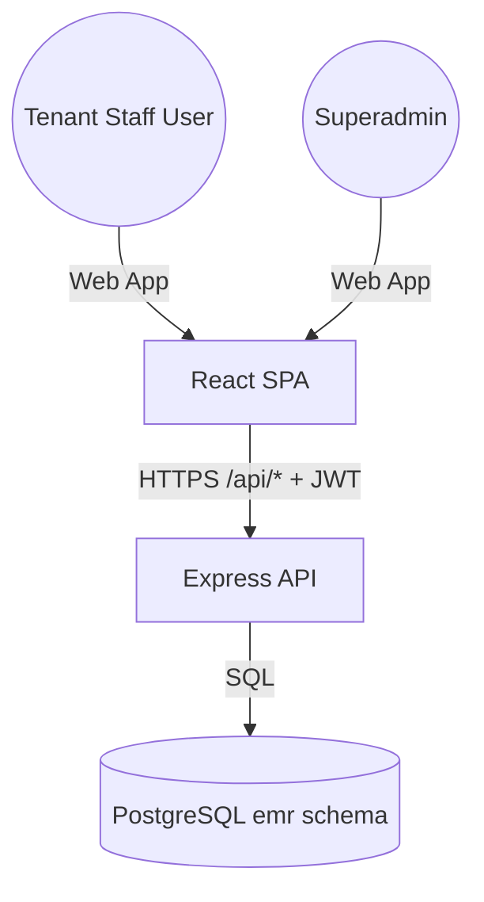
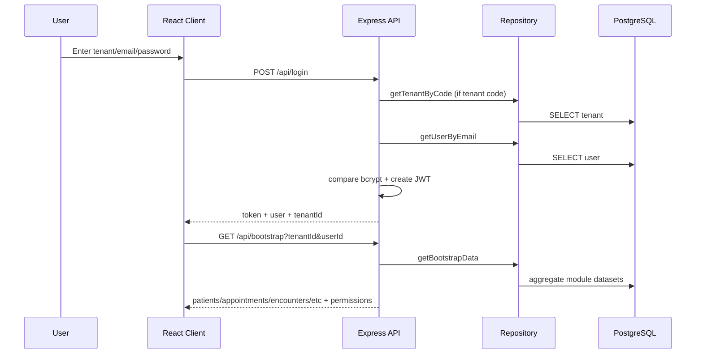
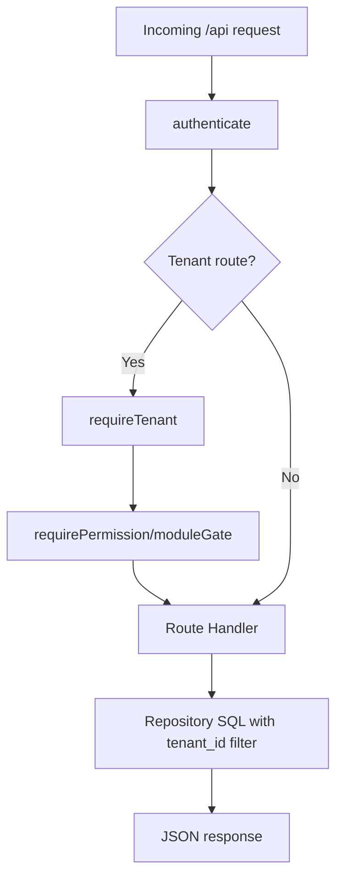
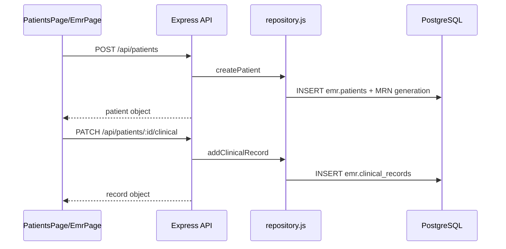
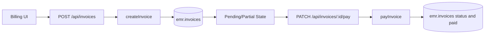
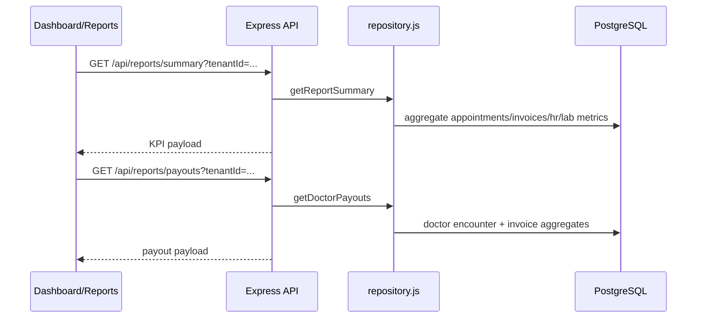
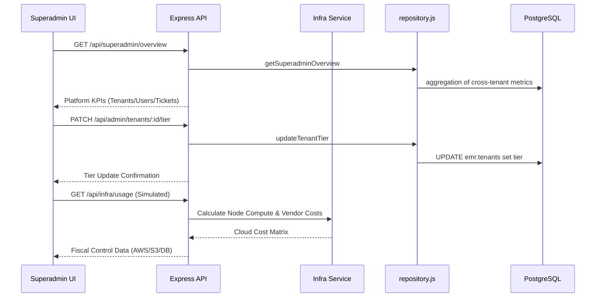

# Data Flow Diagrams

Last updated: 2026-02-19

Diagrams in this file align to active routes and middleware in `server/index.js` and `server/middleware`.

## 1. System Context

## 2. Login and Session Bootstrap

## 3. Tenant-Scoped Request Flow

## 4. Patient Registration and Clinical Updates

## 5. Financial Flow (Invoice to Payment)

## 6. Reports and Analytics Flow

## 7. Superadmin Governance & Platform Economics

