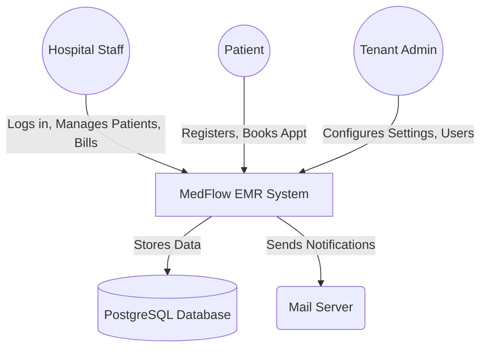
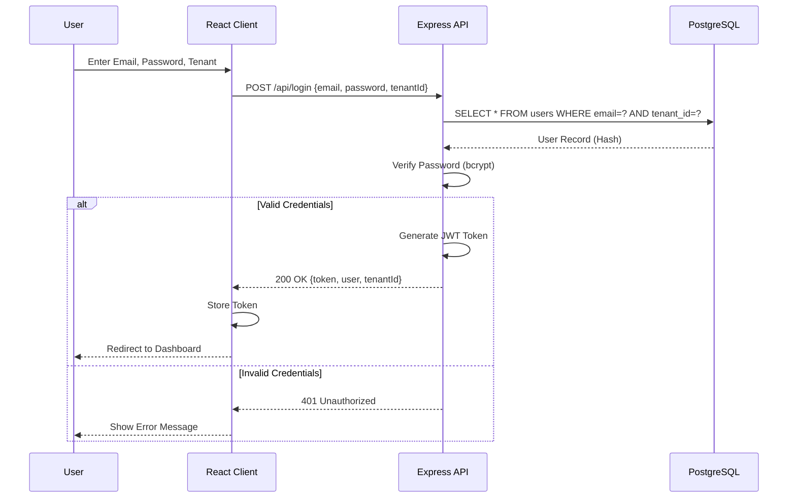
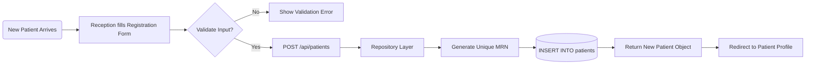
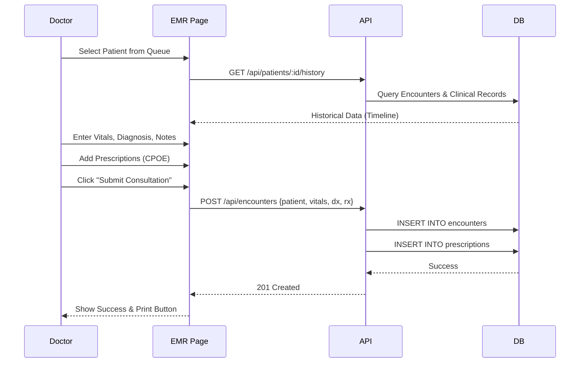
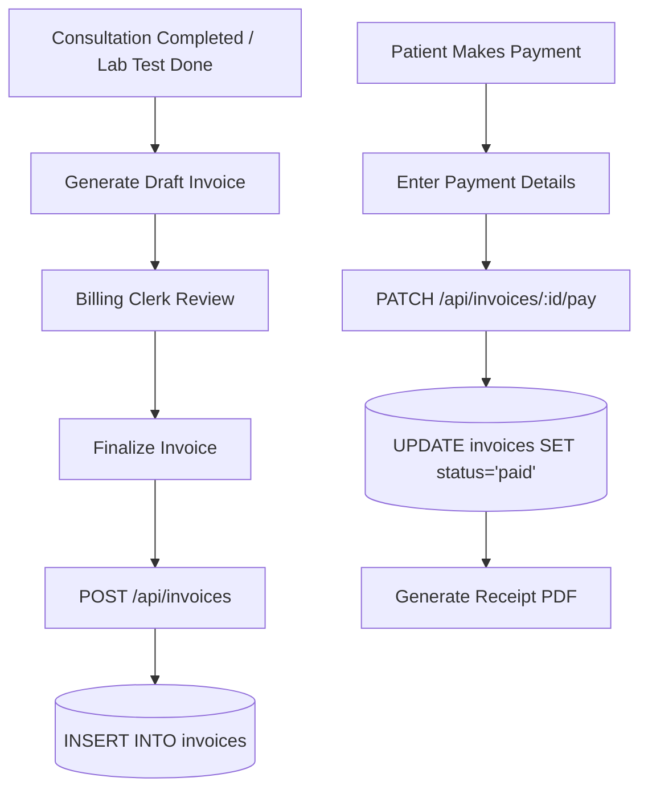
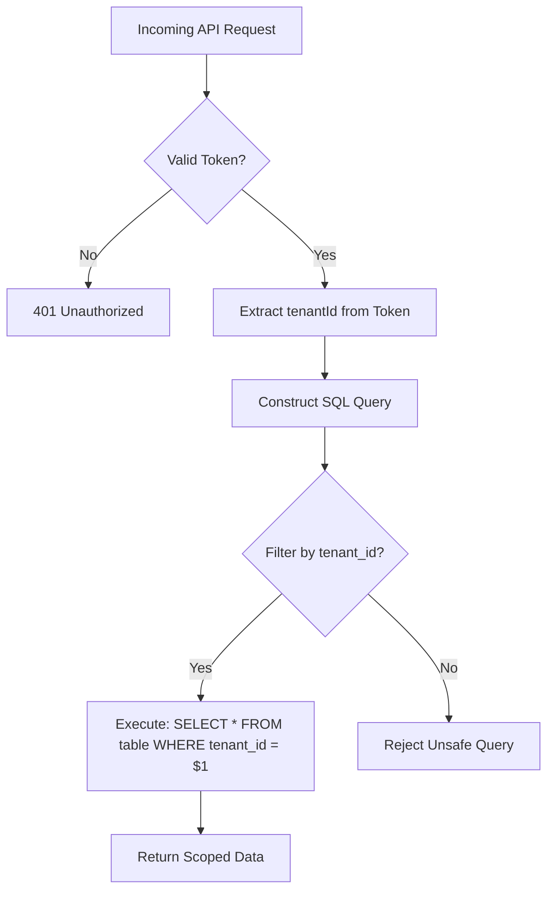

# Data Flow Diagrams (DFD)

This document visualizes the **Data Flow** for core business processes within the MedFlow EMR system using Mermaid diagrams.

---

## 1. System Context Diagram (Level 0)

An overview of external entities and the MedFlow system boundary.

---

## 2. Authentication Flow (Login Process)

The sequence diagram for User Authentication and Session establishment.

---

## 3. Patient Registration Workflow

The data flow from a new patient arrival to the creation of a digital medical record.

---

## 4. Clinical Consultation (EMR) Flow

The interaction between a Doctor and the EMR module during a patient visit.

---

## 5. Billing & Payment Process

The flow of generating an invoice and recording a payment.

---

## 6. Multi-Tenant Data Access

Conceptual flow of how data privacy is enforced across tenants.

