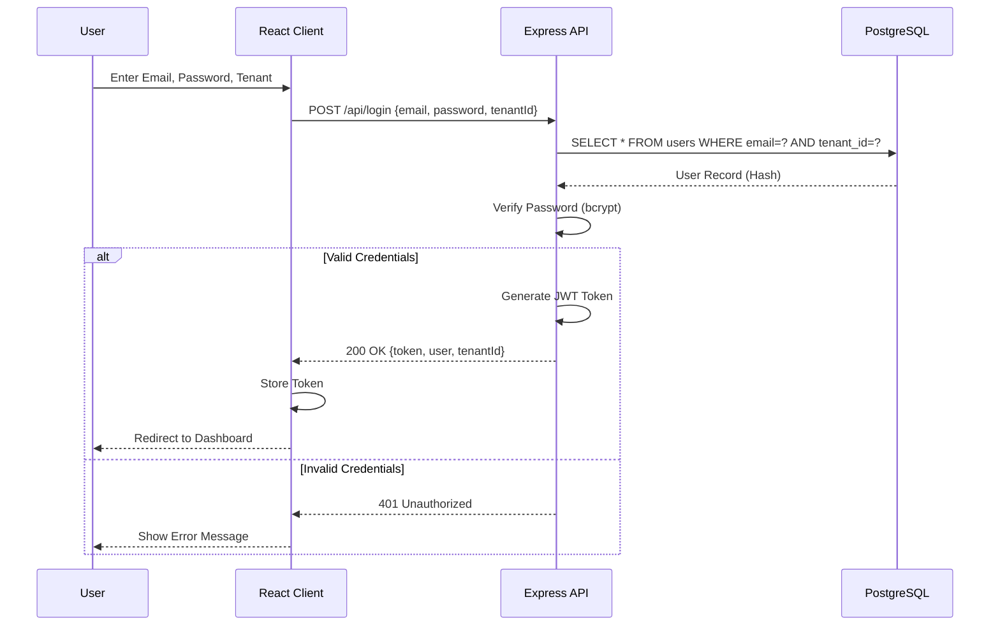
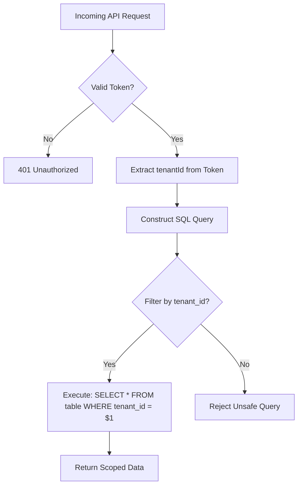

# Technical Design & Architecture - MedFlow EMR

## 1. Architectural Philosophy
The MedFlow EMR follows a **Multi-Tenant SaaS** architecture utilizing a **Single-Page Application (SPA)** frontend and a **Stateless REST API** backend.

### 1.1 Core Principles
- **Tenant Isolation**: Mandatory `tenant_id` scoping at the Repository layer.
- **Unified State**: Top-down data flow managed in `App.jsx`.
- **Defensive UI**: Safe API parsing and robust fallbacks for all clinical data points.

---

## 2. Technology Stack

### 2.1 Frontend
- **Framework**: React 18 (Vite)
- **Styling**: Vanilla CSS + **Premium Glassmorphism Layer**.
- **Icons**: Optimized inline SVG iconography.
- **State**: React Hook based internal state (No external Redux).

### 2.2 Backend
- **Runtime**: Node.js (Express.js)
- **Security**: BCryptJS, JSON Web Tokens (JWT), Helmet, CORS.
- **Database**: PostgreSQL (Managed).

---

## 3. Data Flow Diagrams

### 3.1 Authentication Sequence

### 3.2 Tenant Isolation Flow

---

## 4. Premium Design System (v2.0)

### 4.1 Visual Tokens
- **Glass Panel**: `rgba(255, 255, 255, 0.8)` with `backdrop-filter: blur(20px)`.
- **Dynamic Variable Injection**: Root-level `--tenant-primary` and `--tenant-accent` variables.

### 4.2 UI Components
- **Clinical Sidebar**: Translucent, contextual-aware search and subject cards.
- **Workspace Header**: Tabbed navigation with active indicator glow.
- **Stock Meters**: Horizontal progress indicators with semantic colors (Red/Amber/Green).

---

## 5. Implementation Guide

### 5.1 Repository Pattern
- All database queries reside in `server/db/repository.js`.
- **STRICT RULE**: Every function must accept and enforce `tenant_id`.

### 5.2 Common Workflows
- **Adding a Module**:
  1. Define metadata in `config/modules.js`.
  2. Implement Page in `pages/` using `.premium-glass` panels.
  3. Register view logic in `App.jsx`.
