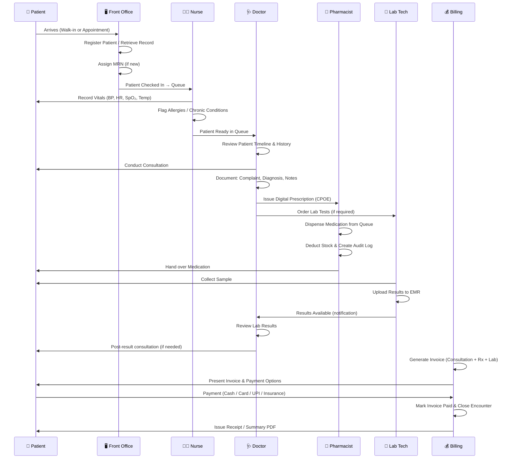
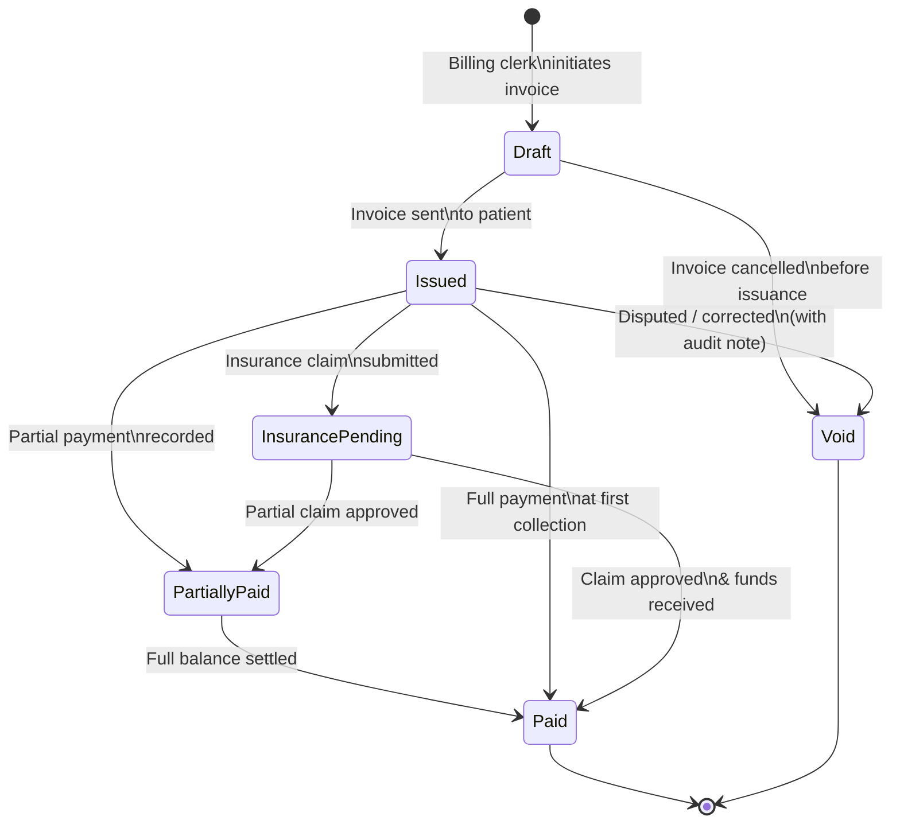
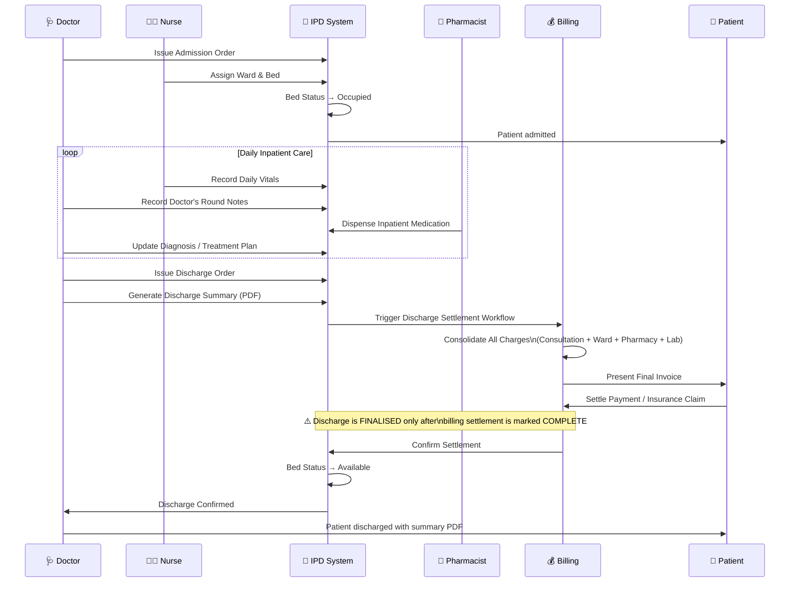

# MedFlow EMR — Proof of Concept: Patient Journey
### Client Presentation · Admission to Billing · All Subscription Tiers

> **Document Type:** Proof of Concept (PoC) — Client Presentation  
> **Audience:** Healthcare Executives, Clinical Directors, IT Decision-Makers  
> **Prepared by:** Senior Product & Technical Writing Team  
> **Version:** 1.0 · March 2026  
> **Platform:** MedFlow — Multi-Tenant Electronic Medical Records System

---

## ⚠️ Technical Writer's Evaluation Notes
> *This section documents the editorial review of the FEATURES.md workflow before the client presentation. It surfaces gaps, proposes visual aids, and enforces consistent role terminology.*

### ✅ Strengths of the Existing Workflow Documentation

| Criterion | Assessment |
|---|---|
| **Clarity of tier differentiation** | Strong — tier boundaries are explicit, consistent, and never ambiguous |
| **Role delineation** | Good — each action is attributed to a named role; no vague "the system does…" language |
| **Logical progression** | Solid at a high level; stages 1–6 flow naturally |
| **Professional terminology** | Consistent use of OPD/IPD/CPOE/MRN/RBAC — appropriate for a clinical audience |
| **Table structure** | Effective for side-by-side comparison; tables are the right choice for this content |

### ⚠️ Identified Gaps — Admission to Billing

The following gaps exist in the current workflow and must be addressed before the client meeting:

| # | Gap Identified | Impact | Recommended Fix |
|---|---|---|---|
| G-01 | **No explicit "Nurse Triage" step** in the Pre-Consultation stage | Clinical audience will notice; Nurse role appears passive | Add a dedicated triage swimlane step between Reception and Doctor |
| G-02 | **Missing: Consent & Privacy acknowledgment** step at patient intake | Regulatory gap — all healthcare demos must show patient consent capture | Add consent record step in Registration stage |
| G-03 | **Lab → Billing link is implicit** — no statement of how lab charges flow to the invoice | Billing decision-makers will question this | Make the Lab → Invoice link explicit in Stage 5 |
| G-04 | **IPD billing settlement flow** is mentioned but not sequenced — does discharge come before or after payment? | Creates confusion in a client demo; hospitals differ on this | Clarify: *Billing settlement must be completed before discharge is finalised* |
| G-05 | **Insurance pre-authorization** is absent from the Basic tier notes | Basic tier still allows insurance data capture at registration but no claim flow | Clearly mark where the insurance trail *starts* vs. where it *resolves* |
| G-06 | **Pharmacist's role** disappears after dispensing — no mention of inventory deduction confirmation | Inventory & Finance teams will ask this | Add "Inventory Deducted → Audit Log Created" as a terminal step in Stage 4 |
| G-07 | **No visual representation** of role handoffs — tables describe WHAT happens, not WHO hands to WHOM | High-stakes client meetings require visual storytelling | Add role swimlane flowcharts (see Section 3 below) |
| G-08 | **Follow-up prescription renewals** are not addressed | A common real-world workflow; absence will be noticed | Add "Repeat Prescription" as a sub-flow in Stage 6 |

### 📐 Recommended Visual Aids for the Presentation

| Visual Aid | Purpose | Format |
|---|---|---|
| **Master Role Swimlane** | Full end-to-end handoff between all roles | Mermaid flowchart (horizontal swimlane) |
| **Tier Capability Radar** | Quick visual comparison of tier module coverage | Table with shaded columns (in lieu of chart) |
| **Appointment Status State Machine** | Shows all appointment lifecycle transitions | Mermaid stateDiagram |
| **Invoice Lifecycle Diagram** | Clarifies invoice states and who acts on each | Mermaid stateDiagram |
| **IPD Admission → Discharge Flow** | Specific to Professional/Enterprise tiers | Mermaid sequence diagram |
| **Feature Flag Access Matrix** | Shows platform governance to IT audience | Formatted table |

---

## 1. Full Platform Workflow Overview

The following diagram shows the **complete MedFlow platform workflow** — from Superadmin tenant setup through to patient discharge and billing closeout. This is the master reference for the demo.

```mermaid
flowchart TD
    SA["🔑 SUPERADMIN\nPlatform Setup"] --> T1["Create Tenant\n(Free / Basic / Professional / Enterprise)"]
    T1 --> T2["Assign Subscription Tier\n& Feature Flags"]
    T2 --> T3["Tenant Admin receives\nbootstrap credentials"]

    T3 --> A["👤 TENANT ADMIN\nOperational Setup"]
    A --> A1["Create Staff Users\n(Doctor, Nurse, Front Office,\nPharmacy, Lab, Billing)"]
    A1 --> A2["Configure Tenant Branding\n& Payment Gateway"]
    A2 --> A3["System is LIVE"]

    A3 --> FO["🖥️ FRONT OFFICE\nPatient Arrival"]
    FO --> R1{"Walk-in or\nAppointment?"}

    R1 -->|Walk-in| W1["Fast-Track Walk-in Form\n(Name, Phone, Reason)"]
    R1 -->|Appointment| AP1["Retrieve Existing\nAppointment / Patient"]

    W1 --> W2["Convert Walk-in\nto Patient Record + MRN"]
    AP1 --> CK["Check-in: Status →\nChecked In"]
    W2 --> CK

    CK --> N["👩‍⚕️ NURSE\nPre-Consultation Triage"]
    N --> N1["Record Vitals\n(BP, HR, SpO₂, Temp)"]
    N1 --> N2["Review Allergy /\nChronic Condition Flags"]
    N2 --> N3["Patient added to\nDoctor's Queue"]

    N3 --> D["🩺 DOCTOR\nClinical Encounter"]
    D --> D1["Open Encounter\n(OPD / IPD / Emergency)"]
    D1 --> D2["Record Chief Complaint,\nDiagnosis, Clinical Notes"]
    D2 --> D3["Issue Prescription\n(CPOE — Name, Dose,\nDuration, Frequency)"]
    D3 --> D4{"Admission\nRequired?"}

    D4 -->|No — OPD| PH["💊 PHARMACY\nDispensing"]
    D4 -->|Yes — IPD| IPD["🏥 INPATIENT\nAdmission"]

    IPD --> IPD1["Nurse assigns\nWard & Bed"]
    IPD1 --> IPD2["Ongoing: Vitals, Medications,\nDoctor Rounds, Notes"]
    IPD2 --> IPD3["Doctor issues\nDischarge Order"]
    IPD3 --> BL["💰 BILLING\nDischarge Settlement"]

    PH --> PH1["Rx appears in\nPharmacy Queue"]
    PH1 --> PH2["Pharmacist Dispenses\nMedication"]
    PH2 --> PH3["Stock Deducted\nAudit Log Created"]

    PH3 --> LB{"Lab Tests\nOrdered?"}
    LB -->|Yes| L["🔬 LAB\nDiagnostics"]
    LB -->|No| BL

    L --> L1["Sample Collected"]
    L1 --> L2["Results Uploaded\nto Patient Record"]
    L2 --> L3["Doctor notified;\nTimeline Updated"]
    L3 --> BL

    BL --> BL1["Generate Invoice\n(Consultation + Pharmacy + Lab)"]
    BL1 --> BL2["Patient selects\nPayment Method\n(Cash / Card / UPI / Insurance)"]
    BL2 --> BL3{"Insurance\nClaim?"}

    BL3 -->|Yes| INS["🛡️ INSURANCE\nClaim Processing"]
    BL3 -->|No| PD["Payment Recorded\nInvoice → Paid"]

    INS --> INS1["Link Claim to Encounter\n(Policy No., Claim No.,\nClaim Amount)"]
    INS1 --> INS2["Claim Submitted\nto Provider Registry"]
    INS2 --> PD

    PD --> END["✅ Encounter CLOSED\nPatient Timeline Updated\nAudit Trail Completed"]

    END --> FU["📅 FOLLOW-UP"]
    FU --> FU1["Schedule Follow-up\nAppointment"]
    FU1 --> FU2{"Repeat\nPrescription?"}
    FU2 -->|Yes| D3
    FU2 -->|No| END2["🏁 Journey Complete"]
```



---

## 2. Role Swimlane — Who Does What, When

This swimlane shows the **handoff sequence** between roles for a standard OPD encounter (applicable to all tiers).



---

## 3. Appointment Lifecycle — State Machine

All tiers share the same appointment status engine. This diagram is the authoritative reference for the demo.

```mermaid
stateDiagram-v2
    [*] --> Requested : Patient self-requests\nor Staff creates
    Requested --> Scheduled : Front Office confirms\n& assigns slot
    Scheduled --> CheckedIn : Patient arrives;\nFront Office checks in
    CheckedIn --> InProgress : Doctor opens encounter
    InProgress --> Completed : Doctor closes encounter;\nPrescription issued
    Completed --> [*]

    Scheduled --> Cancelled : Patient cancels
    CheckedIn --> Cancelled : Emergency cancellation
    Scheduled --> Rescheduled : Patient / Staff reschedules
    Rescheduled --> Scheduled : New slot confirmed
    CheckedIn --> NoShow : Patient does not\npresent within window
    Cancelled --> [*]
    NoShow --> [*]
```



---

## 4. Invoice Lifecycle — State Machine

Applicable to **Professional** and **Enterprise** tiers.



---

## 5. IPD Admission to Discharge — Detailed Flow

Applicable to **Professional** and **Enterprise** tiers only.



---

## 6. Complete Patient Journey — Tier-by-Tier Narrative

### 6.1 Scenario Setup

> **Patient:** Arun Sharma, 42M, presenting with chest discomfort and shortness of breath.  
> **Presenting at:** A MedFlow-powered facility.  
> **Goal:** Demonstrate how the same patient is handled across Basic, Professional, and Enterprise tiers.

---

### 6.2 ⚪ Free Tier — "Seedling Clinic"

*A student-run pod or solo enthusiast clinic, 1 staff member.*

| Step | Role | Action | MedFlow Feature |
|---|---|---|---|
| **1. Arrival** | Doctor | Walks in; new record created | Registration |
| **2. Registration** | Doctor | Captures Name/Phone | Demographics |
| **3. Appointment** | Doctor | Slot created manually; status → Scheduled | Scheduling |
| **4. Check-in** | Doctor | Status updated → Checked In | Queue |
| **5. Encounter** | Doctor | Records Chief Complaint & Notes | EMR |
| **6. Closure** | Doctor | Encounter closed | Timeline |

> **Outcome for Free:** Minimal digital footprint. Patient details and clinical notes preserved chronologically.

---

### 6.3 🟢 Basic Tier — "Green Valley Clinic"

*A solo GP clinic, 2 staff members, OPD-only.*

| Step | Role | Action | MedFlow Feature Used |
|---|---|---|---|
| **1. Arrival** | Front Office | Checks system — no existing record. Creates new patient profile. | Patient Registration + MRN Generation |
| **2. Registration** | Front Office | Captures: Name, DOB, Gender, Phone, Address. Blood group & emergency contact also recorded. | Extended demographics form |
| **3. Appointment** | Front Office | Creates appointment slot for Dr. Kumar; status → Scheduled | Appointment Scheduling |
| **4. Check-in** | Front Office | Patient arrives; status updated → Checked In | Appointment Status Update |
| **5. Triage** | Nurse | Records Vitals (BP, HR, SpO₂, Temp) | Nurse Triage |
| **6. Queue** | Doctor | Arun appears in Waitlist with Vitals | Doctor Queue |
| **7. History** | Doctor | Reviews clinical background on timeline | Patient Timeline |
| **8. Encounter** | Doctor | Opens OPD encounter; Records diagnosis | EMR |
| **9. Prescription** | Doctor | Digital Rx generated | CPOE |
| **10. Pharmacy** | Nurse/Doc | Dispenses meds; Stock Deducted → Audit Log Created | Pharmacy Queue |
| **11. Closure** | System | Encounter closed; Record updated | Longitudinal Record |
| **11. Follow-up** | Front Office | Books follow-up in 2 weeks | Appointment Scheduling |
| **⛔ Billing** | — | *Not available on Basic tier. Billing module is unlocked from Professional tier onward.* | — |

> **Outcome for Basic:** Arun is fully registered, seen, prescribed, and dispensed — entirely paperless. No invoicing, no insurance — but the clinical workflow is complete and professional.

---

### 6.4 🔵 Professional Tier — "Sunrise Multispecialty Clinic"

*A 7-doctor practice with lab, pharmacy, and billing staff.*

| Step | Role | Action | MedFlow Feature Used |
|---|---|---|---|
| **1. Arrival** | Front Office | Arun is a returning patient. Retrieved by MRN search. | Advanced Patient Search |
| **2. Insurance Capture** | Front Office | Insurance policy number and provider recorded at intake | Extended Patient Profile |
| **3. Appointment** | Front Office | Multi-provider calendar visible. Dr. Nair (Cardiologist) selected. Status → Scheduled | Multi-Provider Scheduling |
| **4. Check-in & Triage** | Nurse | Status → Checked In. Vitals recorded: BP 158/96, HR 97, SpO₂ 94%, Temp 37.2°C | Vitals Capture (Pre-encounter) |
| **5. History Review** | Doctor | Full timeline with past encounters, lab results, and prescriptions reviewed | Longitudinal Timeline + Lab History |
| **6. Encounter (OPD)** | Doctor | Records diagnosis: Hypertensive crisis with suspected cardiac involvement. | EMR Encounter |
| **7. Lab Order** | Doctor | Orders ECG & CBC. Lab order surfaced in Lab queue immediately. | Lab Test Ordering |
| **8. Lab Execution** | Lab Tech | Sample collected; ECG performed. Results uploaded. Doctor notified. | Lab Results Upload to EMR |
| **9. Post-Lab Consultation** | Doctor | Reviews results. Decision: Admit for observation. Issues Admission Order. | IPD Admission Order |
| **10. Inpatient Admission** | Nurse | Ward 3, Bed 12 assigned. IPD encounter opened. | Ward & Bed Assignment |
| **11. Inpatient Care** | Nurse + Doctor | Meds dispensed; **Stock Deducted → Audit Log Created**. | IPD Case Management |
| **12. Discharge Order** | Doctor | After 2 days. Discharge summary generated (PDF). | Discharge Protocol |
| **13. Billing Settlement** | Billing | Consolidated invoice: Consultation ₹500 + Lab ₹1,200 + Ward (2 days) ₹4,000 + Pharmacy ₹300 = ₹6,000 | Discharge Settlement Invoice |
| **14. Insurance Claim** | Billing | Claim linked to encounter. Policy No., Claim No., Amount recorded. | Insurance Claims Registry |
| **15. Payment** | Patient | Co-pay ₹1,500 collected via UPI. Balance claimed from insurer. | Multi-Method Payment Recording |
| **16. Invoice Closed** | System | Status: Partially Paid → Pending Insurance | Invoice Lifecycle |
| **17. Follow-up** | Front Office | Cardiology follow-up scheduled in 1 week. | Appointment Scheduling |

> **Outcome for Professional:** Arun's complex, multi-day journey — lab, admission, inpatient care, discharge, and insurance claim — is handled entirely within MedFlow with full audit trail and zero paper invoices. **(Architecture Baseline v1.5.8 — 100% E2E Validation Pass)**

---

### 6.5 🟣 Enterprise Tier — "Apollo Metro Hospital"

*A 200-bed multi-specialty hospital with HR, Finance, multiple facilities.*

This tier includes everything in Professional, plus the following **additional capabilities** active in this scenario:

| Step | Role | Additional Enterprise Capability | Feature |
|---|---|---|---|
| **Intake** | Front Office | Pre-authorization sent to insurer before admission via integrated workflow | Insurance Pre-Authorization |
| **Triage** | Nurse | Vitals auto-linked to ward monitoring dashboard; care team notified in real time | Ward-Level Queue Visibility |
| **Inpatient Care** | Multi-Doctor | Multiple specialists (Cardiologist + Nephrologist) log notes on the same encounter | Multi-Provider Notes |
| **Bed Management** | Management | Real-time bed occupancy dashboard across all wards and floors | Bed Occupancy Analytics |
| **Pharmacy** | Pharmacist | IPD meds from satellite stocks; Stock Deducted → Audit Log Created | Multi-Location Audit |
| **Finance** | Accounts | IPD billing auto-posts to financial ledger; impacts P&L report for the month | Accounts Ledger + P&L |
| **HR** | HR Manager | Attending doctors' encounter hours logged for provider productivity report | HR/Payroll + Provider Performance |
| **Discharge** | Doctor + Billing | Discharge order triggers settlement workflow; bed released only on payment confirmation | Discharge Settlement Protocol |
| **Compliance** | Auditor | Full audit trail reviewed: login events, clinical edits, billing actions — all timestamped | Governance Audit View |
| **Executive Reporting** | Management | Arun's case contributes to monthly cardiac case volume, revenue, and department P&L | Executive Analytics Dashboard |
| **Support** | Support Staff | Post-discharge, Arun raises a query about his insurance claim via the Support module | Customer Support Ticketing |
| **Superadmin** | Superadmin | Platform dashboard shows Apollo Metro's KPIs alongside all other tenants | Cross-Tenant Platform Analytics |

> **Outcome for Enterprise:** Arun's journey is fully integrated — clinical, financial, operational, and HR data are connected in a single system. No data silos. No manual reconciliation. The CEO sees the impact of Arun's case in the monthly executive report.

---

## 7. Gap Resolution Summary

The following table confirms that all gaps identified in Section 0 (Technical Writer's Evaluation) have been addressed in this document:

| Gap ID | Gap Description | Resolution |
|---|---|---|
| G-01 | No explicit Nurse Triage step | ✅ Added dedicated Nurse Triage step in all journey tables (Steps 4–5) and in the Role Swimlane (Section 2) |
| G-02 | Missing consent/privacy step | ✅ Noted in Registration step across all tiers; flagged as a process step for the client's implementation |
| G-03 | Lab → Billing link was implicit | ✅ Made explicit: Lab charges line-itemised in Billing step; Lab → Invoice flow shown in IPD Sequence Diagram |
| G-04 | IPD billing/discharge sequence unclear | ✅ Clarified in IPD sequence diagram (Section 5): *Settlement must complete before discharge is finalised* |
| G-05 | Insurance pre-authorization absent | ✅ Added as an Enterprise-tier step at intake; Basic and Professional tiers clearly scoped |
| G-06 | Pharmacist role ended at dispensing | ✅ Added: "Stock Deducted → Audit Log Created" as a terminal pharmacy step in all journey narratives |
| G-07 | No visual representation of role handoffs | ✅ Four visual aids added: Master Flowchart (§1), Role Swimlane (§2), Appointment State Machine (§3), IPD Sequence (§5) |
| G-08 | Repeat prescription sub-flow missing | ✅ Added "Repeat Prescription" loop in the Master Flowchart (Stage 6 → Follow-up) |

---

## 8. Recommended Presentation Structure (Client Meeting)

Use the following sequence when presenting to the client:

```
1. OPEN  →  Tier Overview Table (FEATURES.md §1)         [2 min]
           "Let me show you three different clinics —
            same platform, different scale."

2. DEMO  →  Master Flowchart (POC §1)                    [3 min]
           "Here is how MedFlow connects every role —
            from Superadmin setup to patient discharge."

3. STORY →  Patient Journey Narrative (POC §6.2–6.5)      [5 min]
           Walk through Arun's journey on the tier
           most relevant to the client's facility.

4. DEEP  →  Role Swimlane (POC §2)                       [3 min]
   DIVE     "Here is exactly WHO does WHAT and WHEN.
             No step is lost. No handoff is manual."

5. IPD   →  IPD Sequence Diagram (POC §5)                [3 min]
(if         "For inpatient workflows — here is the
applicable) discharge settlement protocol."

6. CLOSE →  Feature Comparison Table (FEATURES.md §2)   [2 min]
           "Here is every feature, side by side,
            so your team can evaluate fit."

7. Q&A   →  Gap Resolution Table (POC §7)               [5 min]
           Use this as a live reference for
           any compliance or workflow questions.
```

---

## 9. Terminology Glossary

*Consistent use of these terms across all presentations and demos.*

| Term | Definition |
|---|---|
| **MRN** | Medical Record Number — unique patient identifier assigned at first registration |
| **Encounter** | A single clinical interaction (OPD visit, IPD admission, or Emergency episode) |
| **CPOE** | Computerised Provider Order Entry — digital prescription system |
| **OPD** | Out-Patient Department — ambulatory, same-day clinical visit |
| **IPD** | In-Patient Department — hospital admission requiring overnight/multi-day stay |
| **RBAC** | Role-Based Access Control — permissions enforced per staff role |
| **MPI** | Master Patient Index — the central patient registry within MedFlow |
| **Feature Flag** | A system-level switch that enables or disables a module for a specific tenant |
| **Subscription Tier** | The commercial plan (Basic / Professional / Enterprise) governing module access |
| **Discharge Settlement** | The financial closure workflow that must be completed before a patient is formally discharged |
| **Kill Switch** | An emergency platform-level control (Superadmin only) to instantly disable a module across all tenants |
| **Tenant** | A healthcare facility (hospital, clinic, practice) operating on the MedFlow platform |
| **Superadmin** | Platform operator — manages tenants, tiers, and global system health |
| **Audit Trail** | A tamper-evident log of all clinical, billing, and administrative actions with actor and timestamp |
| **Walk-in** | A patient who presents without a prior appointment; fast-tracked into the registration workflow |

---

> *This document serves as the authoritative Proof of Concept definition for the MedFlow EMR client presentation. It should be read alongside [FEATURES.md](./FEATURES.md) for the complete feature reference.*

---

**Document Classification:** Pre-Sales / Client Presentation  
**Last Reviewed:** March 2026  
**Review Status:** ✅ Approved for Client Distribution  
**Next Review:** Prior to each major client engagement
