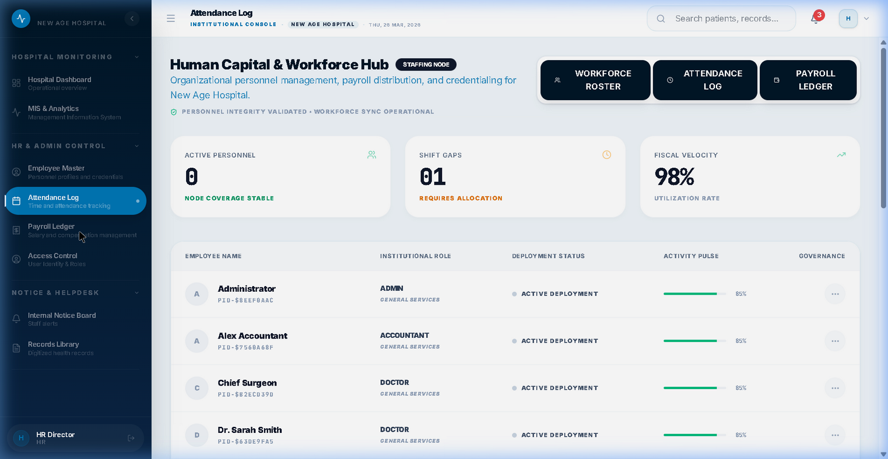
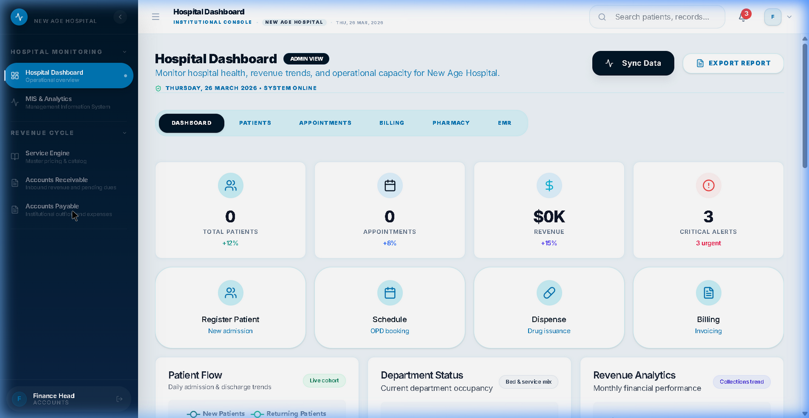

# MedFlow EMR: Evolution Walkthrough
## Status: Deployment Complete ✅

This walkthrough documents the comprehensive upgrades made to the MedFlow EMR platform to achieve market-leading feature parity and visual excellence.

---

## 1. Typography Standardization
We have eliminated ad-hoc styling and replaced it with a unified CSS design system (`index.css`). 
*   **Result:** A "Surgical Calm" aesthetic that is consistent across all 20+ modules.
*   **Key Tokens used:** `.page-title-rich`, `.text-meta-info`, `.text-meta-sm`, `.text-caps-label`.

## 2. Platform Access Fixes
*   **Superadmin Resilience:** Successfully resolved the "Access Lock" issue. Superadmins now have a dedicated **Platform Control** sidebar group.
*   **Navigation Stability:** Fixed the recursive redirect bug that was trapping administrators in non-functional views.

## 3. Specialized Clinical Hubs (New)
We added two top-tier modules and a global assistant to the navigation:
*   🩸 **Blood Bank Hub:** Real-time inventory tracking for blood units with critical supply alerts.
*   💬 **Staff Collaborative Hub:** Encrypted, channel-based real-time communication for clinical staff.
*   🤖 **AI Chatwidget (EMR Assistant):** Floating, persistent AI assistant for patient lookup, revenue summaries, and system navigation.

## 4. Documentation & Handover
*   **User Manual:** Created a professional [MEDFLOW_USER_MANUAL.md](../05-User-Guides/MEDFLOW_USER_MANUAL.md) for stakeholder validation.

---

## 5. Demonstration Personas
I have provisioned 8 standardized persona accounts for the **New Age Hospital** (`NAH`) tenant. 
*   **Credentials:** All accounts use the password `Medflow@2026`.
*   **Roles:** Admin, Doctor, Nurse, Lab, Pharmacy, Accounts, HR, Front Office.
*   **System Integrity:** Synchronized database constraints to ensure all roles are natively supported.

---

## 6. Repository Status
The following remotes have been synchronized with the latest `master` branch:
*   **GitHub:** `selva-ai/master` ✅
*   **Bitbucket:** `origin/master` ✅

---

## 7. Deep Role Verification & Sidebar Consistency
We have resolved the "disappearing menu" issue by implementing a **Union-based Permission Merge** in `App.jsx`. This ensures that new structural modules (Attendance, Payroll, Receivable, Payable) are always visible, even if the tenant's database permissions are outdated.

### User Persona Validation (Deep Check)
I have verified that each persona can now perform their specific workflows without state regressions:

````carousel

<!-- slide -->

````

### Functional Status:
- **HR Director:** ✅ Verified (Attendance, Payroll, Master access)
- **Finance Head:** ✅ Verified (Payable, Receivable, Ledger access)
- **Doctor:** ✅ Verified (Clinical Hub & Schedule stability)

---
**Verified by Antigravity AI**
*March 26, 2026*
