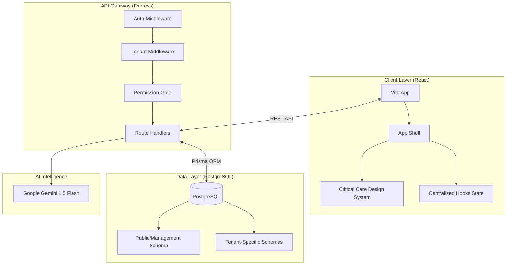

# Technical Design & Architecture - MedFlow EMR

## 1. System Architecture
MedFlow is a **Multi-Tenant SaaS SPA** built on a React (Vite), Express.js, and PostgreSQL stack.

### 1.1 Multi-Tenant Sharding Strategy
The system uses a **dedicated schema for each tenant** to ensure data isolation.
- **Platform Management (`emr` / `management` schema)**: Stores global tenant registration, subscription tiers, and feature flags.
- **Tenant Data (`tenant_...` schema)**: Every patient, doctor, and financial record resides in a tenant-specific isolated schema.
- **Tenant Context**: Injected via the `x-tenant-id` header in every frontend request.

---

## 2. Technical Tech Stack

| Layer | Component | Technology | Rationale |
|---|---|---|---|
| **Frontend** | Framework | React 18 (Vite) | High-speed hot module reloading and UI reactivity. |
| | Style | Vanilla CSS | Premium Glassmorphic design with zero-runtime overhead. |
| | Charts | Apache ECharts | Enterprise performance for high-density medical metrics. |
| **Backend** | Runtime | Node.js (Express) | Scalable, non-blocking asynchronous I/O. |
| | ORM | Prisma 7 | Type-safe database management and schema migrations. |
| | Driver | @prisma/adapter-pg | Optimization for Supabase and pgbouncer pools. |
| | Identity | JWT (RS256) | Stateless authentication with encapsulated tenant claims. |
| **Intelligence** | Engine | Gemini-1.5-Flash | Leading LLM for clinical summarization and navigation. |

---

## 3. Core Domain Modules

- **Platform Layer**: Superadmin panel for tenant creation, feature flags, and subscription monitoring.
- **Clinical Module**: Patient management, consultations, v-vitals, e-prescriptions, and IpD.
- **Operational Modules**: Laboratory, Pharmacy, Blood Bank, and Inventory.
- **Financial Module**: Invoicing, doctor payouts, insurance claims, and P&L summaries.
- **Workforce Module**: HR master, employee attendance, leaves, and payroll triggers.
- **Communication Module**: Peer chat and institutional notice board.

---

## 4. Security Philosophy
1. **Zero-Trust Tenant Boundaries**: All SQL queries are parameter-injected with the tenant's context.
2. **Stateless Identity**: Token-based auth prevents server-side session bloat.
3. **Data Integrity**: Immutable audit logs capture every state mutation in clinical and financial modules.
4. **Resiliency**: Startup verification tasks ensure database schema parity before the server starts.

---

## 5. Development Standards
- **Component Pattern**: Centralized state management in `App.jsx`.
- **API Registry**: Modular route definitions in `server/index.js` and `server/middleware/`.
- **Repository Pattern**: Centralized data access in `server/db/repository.js`.
