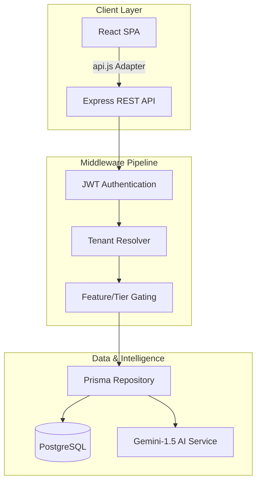

# MedFlow EMR - Technical Design Authority

## 1. Architecture Overview
MedFlow utilizes a modern, multi-tenant SaaS architecture designed for high-availability clinical environments. The system is partitioned into three logical planes:

- **Platform Plane (Superadmin)**: Governance, tenant provisioning, and global telemetry.
- **Institutional Plane (Admin)**: Hospital-specific configuration, RBAC, and fiscal settings.
- **Clinical Plane (Staff)**: Real-time patient care, EMR, and departmental workflows.

### 1.1 Core Tech Stack
| Layer | Technology | Rationale |
| :--- | :--- | :--- |
| **Frontend** | React 19 + Vite | High-performance SPA with sub-second HMR. |
| **Styling** | Vanilla CSS (Custom) | Zero-runtime overhead; proprietary "Critical Care" design system. |
| **Backend** | Node.js (Express) | Asynchronous, middleware-driven REST API. |
| **Database** | PostgreSQL + Prisma | ACID-compliant persistence with type-safe tenant isolation. |
| **Intelligence** | Google Gemini 1.5 | Generative AI for clinical summarization and decision support. |
| **Analytics** | Apache ECharts | Enterprise-grade data visualization for high-density clinical metrics. |

---

## 2. Multi-Tenant Data Strategy
MedFlow employs a **Schema-Isolated Multi-Tenancy** model using Prisma ORM.

### 2.1 Isolation Mechanism
1. **Tenant Resolution**: Middleware extracts `tenant_id` from JWT or headers.
2. **Prisma Scoping**: A centralized `PrismaService` wraps all queries with an automatic `WHERE tenant_id = $1` filter.
3. **Database Constraints**: Composite unique indexes (e.g., `@@unique([tenantId, mrn])`) prevent cross-tenant collisions.

---

## 3. High-Level Data Flow

---

## 4. Security & Audit Model
- **Stateless Auth**: JWT (RS256) with tenant-scoped claims.
- **Audit Ledger**: Immutable transaction logging for all clinical mutations (Lab, Pharmacy, Admissions).
- **Zero-Trust Superadmin**: Superadmins manage tenant *metadata* but are blocked from tenant *data* nodes without explicit break-glass credentials.

---

## 5. "Critical Care" Design System
The UI adheres to professional healthcare standards:
- **Primary Palette**: Medical Navy (`#0F4C75`), Clinical Blue (`#2E86AB`), Health Green (`#A13B72`).
- **Cognitive Ergonomics**: High-contrast ratios (WCAG 2.1 AA), 16px base typography, and emergency-ready alert patterns.
- **Visual Cues**: Real-time stock pulse meters, color-coded vitals telemetry, and role-specific dashboard variants.

---

## 6. Implementation Authoritative Source
- **Root State & Routing**: `client/src/App.jsx`
- **Identity & Auth Adapter**: `client/src/api.js`
- **Tenant Isolation Logic**: `server/middleware/auth.middleware.js`
- **Global Feature Matrix**: `server/services/featureFlag.service.js`
- **Clinical AI Logic**: `server/services/ai.service.js`
